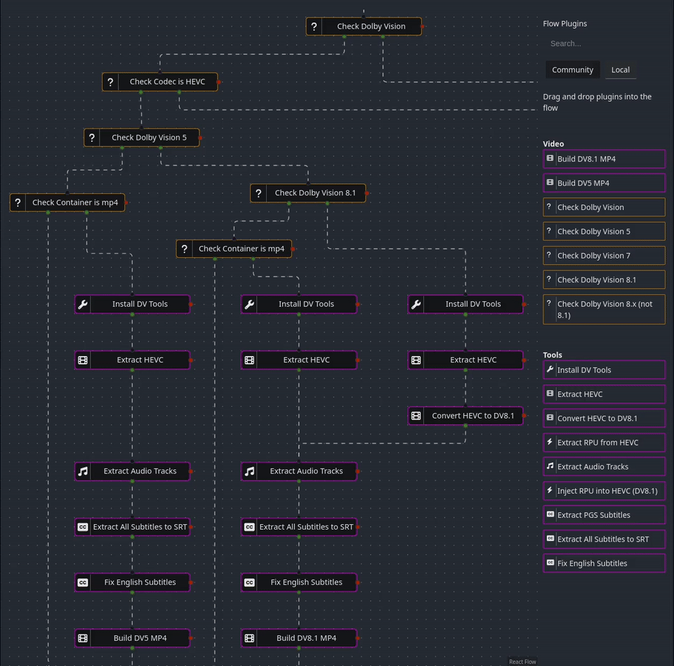

# Tdarr Dolby Vision Flow Plugins 🎬



Flow plugins for Tdarr focused on Dolby Vision: detect profiles, convert Dolby Vision streams safely, and remux to device-friendly MP4 while keeping audio/subtitle metadata intact. 🎯

I found that existing tooling for handling Dolby Vision is fragmented and hard to follow, especially when it comes to managing media in Tdarr. 

There are a lot of high quality media releases that come across in native DV7, which isn't supported by many media players, such as LG OLED models. These tools can be used to convert DV7 and DV8.x media into DV8.1, which can be played directly over Jellyfin or Plex on many modern sets. 

Check your model for codec support.

## Install 🛠️
Prereqs: `curl` or `wget`, and `tar` (standard on most distros).

1) Run the installer; it downloads the latest plugins from `https://github.com/eebette/Tdarr_DolbyVision_Plugins` (no git required—curl/wget + tar) and copies only the plugin `index.js` files into Tdarr:
   ```bash
   # Download and run
   ./install_flow_plugins.sh /path/to/tdarr/server
   ```
   ```bash
   # or one-liner:
   bash <(curl -fsSL https://raw.githubusercontent.com/eebette/Tdarr_DolbyVision_Plugins/refs/heads/master/install_flow_plugins.sh) /path/to/tdarr/server
   ```
   ```bash
   # or as root:
   sudo bash -c 'curl -fsSL https://raw.githubusercontent.com/eebette/Tdarr_DolbyVision_Plugins/refs/heads/master/install_flow_plugins.sh -o /tmp/install_flow_plugins.sh && bash /tmp/install_flow_plugins.sh /path/to/tdarr/server'
   ```
   Example: `/opt/tdarr/server` ⇒ `/opt/tdarr/server/Tdarr/Plugins/FlowPlugins`.
2) Restart Tdarr so the flows appear in the UI.
3) Optional: import the example flow from `DolbyVisionFlow.txt` in Tdarr:
   - Tdarr → Flows → Flow + → Import JSON Template + → paste the contents of `DolbyVisionFlow.txt` → click + (bottom-left of the textbox).

## How these flows are meant to be used
- Filters decide which Dolby Vision profile a file carries so you can branch flows cleanly.
- Tools extract or normalize video/audio/subtitles and manipulate Dolby Vision RPUs.
- Builders remux to MP4 with MP4Box and explicit Dolby Vision profile flags for maximum compatibility.

## Plugin catalog 📦
### Video filters and builders
- `video/checkDolbyVision`: Detects any Dolby Vision metadata (any profile) and routes yes/no. Useful as the first branch in a flow.
- `video/checkDolbyVision5`: Routes files that are specifically Dolby Vision Profile 5; everything else goes to the alternate path.
- `video/checkDolbyVision7`: Routes files that are Dolby Vision Profile 7 (dual layer or single), otherwise sends to the non-DV7 path.
- `video/checkDolbyVision81`: Routes files that are Dolby Vision Profile 8.1 (profile=8, bl_signal_compatibility_id=1); everything else goes to the alternate path.
- `video/checkDolbyVision8x`: Routes files that are Dolby Vision Profile 8.x but not 8.1 (e.g., 8.2/8.4) so you can convert or reject as needed.
- `video/buildDv81Mp4`: Final remux step that reads `audio.exports` and `subtitles.exports` manifest files created by `Extract Audio Tracks` and `Extract All/PGS Subtitles`, respectively, then uses MP4Box to produce a Dolby Vision 8.1 MP4 with proper language tags and track titles.
- `video/buildDv5Mp4`: Similar to the 8.1 builder but targets Dolby Vision Profile 5 MP4 outputs using MP4Box with profile flags and clean track metadata.

### Tools
- `tools/installDvTools`: Installs user-local dependencies (MP4Box/GPAC, dovi_tool, dotnet runtime, PgsToSrt, tessdata) without needing root; idempotent per user directory.
- `tools/convertHevc`: Converts HEVC bitstreams using `dovi_tool` with configurable conversion modes (0-5). Default mode 2 converts to Profile 8.1. Supports `--discard` flag for removing Enhancement Layer when converting from dual-layer profiles. All commands are logged for debugging.
- `tools/extractHevc`: Copies or re-encodes video to HEVC (x265) when needed, always applying hevc_mp4toannexb bitstream filter for consistent Annex B format output suitable for dovi_tool processing.
- `tools/extractRpu`: Uses `dovi_tool` to pull RPU metadata from the source and saves it for later injection or profile conversion.
- `tools/injectRpuIntoHevc`: Injects a provided RPU file back into an HEVC stream, producing a DV-ready elementary stream for remux.
- `tools/extractAudioTracks`: Extracts audio tracks with ffmpeg into discrete files and writes `audio.exports` metadata; optionally converts TrueHD/DTS to E-AC-3 for compatibility.
- `tools/extractAllSubtitles`: Extracts every subtitle stream to SRT (text copied; PGS via PgsToSrt OCR) and writes `subtitles.exports` for remuxers.
- `tools/extractPgsSubtitles`: Exports one subtitle per language, preferring text codecs and OCR-ing PGS to SRT with tesseract language selection, writing `subtitles.exports`.
- `tools/fixEnglishSubtitles`: Cleans common English OCR errors in SRT files listed in `subtitles.exports` with conservative (but common) character/word fixes.
- `tools/cleanupDvCache`: Cleans up temporary Dolby Vision processing files from the cache directory.

#### dovi_tool Conversion Modes
The `convertHevc` plugin supports the following dovi_tool modes:
- **Mode 0**: Parse & rewrite RPU untouched
- **Mode 1**: Convert to MEL (Middle Enhancement Layer) compatible
- **Mode 2**: Convert to profile 8.1 (removes luma/chroma mapping for P7 FEL) - **Default**
- **Mode 3**: Convert profile 5 to 8.1
- **Mode 4**: Convert to profile 8.4
- **Mode 5**: Convert to profile 8.1 preserving mapping (legacy mode 2)

## Typical flow examples 🔄
- DV7/DV8.x source → `checkDolbyVision7` → `extractHevc` + `extractRpu` → `convertHevc` (mode 2, with --discard for DV7) → `injectRpuIntoHevc` → `extractAudioTracks` + `extractAllSubtitles` → `buildDv81Mp4`.
- DV5 source → `checkDolbyVision5` → `extractHevc` (copy) + `extractAudioTracks` + `extractAllSubtitles` → `buildDv5Mp4`.
- DV8 source → Same as DV5 source but with `buildDv81Mp4` instead.

**Note**: All tool plugins now log the exact commands being executed (prefixed with 📋 Command:) for easier debugging and troubleshooting.

## Acknowledgements 🙏
- Community Dolby Vision knowledge bases and discussions.
- Reddit thread on DV P7→8.1/MP4Box: https://old.reddit.com/r/ffmpeg/comments/11gu4o4/convert_dv_profile_7_to_81_using_dovi_tool_mp4box/jn5gman/
- dvmkv2mp4: https://github.com/gacopl/dvmkv2mp4
- Tdarr_Plugins_DoVi: https://github.com/andrasmaroy/Tdarr_Plugins_DoVi
- MP4Box/GPAC and dovi_tool contributors.
- Tdarr plugin ecosystem and prior Dolby Vision plugin authors. 
